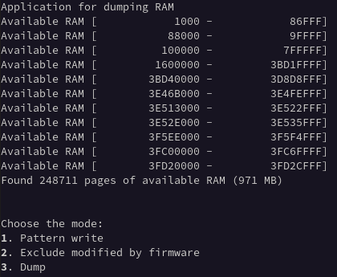

# RAM data dumper

This UEFI application minimalistic application to dump RAM. Based on
[Dasharo/ram-remanence-tester](https://github.com/Dasharo/ram-remanence-tester).

## Building

Supported architectures:
- `x86_64`

Prerequisites:

- `gcc`, `make`
- `gnu-efi`
- `gnu-efi-devel`

It is known to work with GCC 14.2.1 and both `gnu-efi` packages in version
3.0.18, as found in Fedora 40. Older versions of `gnu-efi` may require different
build options than those defined in Makefile.

To build, simply run:

```shell
make
```

This will produce `BOOTx64.EFI` file that should be copied to USB drive
formatted as FAT32 (not exFAT) to `/EFI/BOOT/` directory.

## Use

Plug in the drive and boot the tested platform from it. It will show available
RAM and EFI descriptors. Then, it will start dumping values of RAM addresses
from EFI descriptors into the drive from which it has been booted.

After booting the application, there will be three options to choose from:



At first, choose option `1`. The application will fill up the available RAM with
a pattern. This will allow to detect what addresses were overwritten by firmware
after reboot.

Then, reboot to the same application and choose option `2`. The application will
scan the RAM for addresses that were modified by firmware after reboot and
exclude them from the final dump.

After the second option, you can reboot to your system (e.g., some Linux
distribution) or your application, which RAM data should be dumped. When
you think it is time to dump RAM - reboot to the EFI application either via
warm or cold boot and choose option `3`. The application will dump RAM into
files on the partition where the application is being stored. It **is
important** then to make the partition with the appropriate size to store dumped
RAM.

The files will be named in the following way:

```bash
ls /mnt
2025_04_29_14_27_0x0000000000001000.csv  2025_04_29_14_27_0x000000003F5EE000.csv
2025_04_29_14_27_0x0000000000100000.csv  2025_04_29_14_27_0x000000003FC00000.csv
2025_04_29_14_27_0x0000000001600000.csv  2025_04_29_14_27_0x000000003FD20000.csv
2025_04_29_14_27_0x000000003BD48000.csv  EFI
```

That is `YEAR_MONTH_DAY_HOUR_MINUTE_START-ADDRESS.csv`, where the
`START-ADDRESS` is the address from where the dumping began, and the size of a
file is the amount of dumped memory starting from the address. Some start
addresses and sizes may correspond to the numbers on the image above, and some
may not. This is because some addresses were modified by firmware and were
excluded or shrunk from the dump.

## Limitations and issues

There are two major limitations of the application:
1. Sometimes firmware may pollute RAM with a lot of data with a length of about
  one page that is separated with addresses unmodified by firmware, e.g.:

    ```bash
    71c0a1c0  00 00 00 00 00 00 00 00  00 00 00 00 00 00 00 00  |................|
    *
    71c0a200  be ef de ad be ef de ad  be ef de ad be ef de ad  |................|
    *
    71c180c0  00 00 00 00 00 00 00 00  00 00 00 00 00 00 00 00  |................|
    *
    71c18100  be ef de ad be ef de ad  be ef de ad be ef de ad  |................|
    *
    71c193c0  00 00 00 00 00 00 00 00  00 00 00 00 00 00 00 00  |................|
    *
    71c19400  be ef de ad be ef de ad  be ef de ad be ef de ad  |................|
    *
    71c1b140  00 00 00 00 00 00 00 00  00 00 00 00 00 00 00 00  |................|
    *
    71c1b180  be ef de ad be ef de ad  be ef de ad be ef de ad  |................|
    *
    71c28180  00 00 00 00 00 00 00 00  00 00 00 00 00 00 00 00  |................|
    ```

    This will cause the application during step two (excluding RAM modified by
    firmware) to divide such RAM into many small sectors that require adding
    additional EFI memory descriptors per sector. Sometimes, the amount of
    needed descriptors exceed [statically defined
    amount](https://github.com/zarhus/ram-dump-efi/blob/cf5a22e46e6698e74112e5c5401209b6407e9941/app.c#L33)
    and cause the following error:

    ```bash
    Assertion failed: app.c:220: MmapEntries < MEMORY_DESC_MAX
    ```

    The error could be worked around by increasing allowed number of the
    descriptors via the definition. But the amount is limited by the [EFI
    variable](https://github.com/zarhus/ram-dump-efi/blob/9b0213337a2df2e0de970f9b935f6e2e483e7897/app.c#L344)
    as well and cannot be increased to infinity.

1. The second step (excluding RAM modified by firmware) assumes that firmware
  writes its data under the same addresses during every boot. This might not be
  true for some firmware. The application was tested on [Dasharo
  firmware](https://docs.dasharo.com/) on several platforms, including QEMU, and
  the assumption always fulfilled.

## Validation script

Analyzing dumped memory manually is close to impossible. You can instead use the
script located in `scripts/validation.py`. The tool reads bytes from `csv` files
in the directory given by the first argument and returns lists of zero and
non-zero regions. It analyzes data in blocks of 65536 bytes - zero regions
smaller than that will not be taken into account. It's important to note that
the input files need to conform to the naming scheme used by the RAM dumper -
`<datetime>_<hex_start_address>.csv`. The script will calculate the physical
address of each block by adding the offset to the start address.

Example usage and output:

```bash
python3 scripts/validate.py ./
=== Zeroed Memory Regions ===
0x00100000 - 0x00200000

=== Non-Zero Memory Regions ===
0x00200000 - 0x00800000
```

## Credits

This research has been supported by [Power Up
Privacy](https://powerupprivacy.com/), a privacy advocacy group that seeks to
supercharge privacy projects with resources so they can complete their mission
of making our world a better place.
